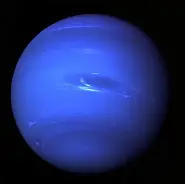

# Programacion y plataforma web (PPW)

## Práctica 1 - Explorando 

**Asignatura:** Programación y Plataforma web  
**Unidad:** 1.2- Estandares web  
**Estudiante:** Miguel Vanegas  
**Repositorio:** [https://github.com/MiguelV145/icc-ppw-u1-Mi_Pagina_Web]  
**Página desplegada (GitHub Pages):** [https://miguelv145.github.io/icc-ppw-u1-Mi_Pagina_Web/]

---

## Estructura HTML utilizada

| Componente | Descripción | Implementación |
|-------------|--------------|----------------|
| `<!DOCTYPE html>` | Declaración del documento HTML5 | Línea 1 |
| `<html lang="es">` | Idioma del documento | Español |
| `<header>` | Encabezado principal | Contiene `<h1>` y `<h2>` |
| `<section>` | Agrupa contenido principal | Dos secciones con `<h2>` |
| `<table>` | Muestra los elementos estudiados | Tres filas con `<th>` y `<td>` |
| `<footer>` | Pie de página | Nombre del estudiante y asignatura |

## Nuevas etiquetas utilizadas

| Etiqueta  | Descripción  | Implementacion  |
|------------|-------------|-----------|
|`<article>` | Sección independiente del contenido principal, como un artículo, comentario o publicación. | descripcion de un planeta |
| `aside` |   Informacion complementaria  | nota o informacion extra |

**Código usado:**

```html
<article>
    <h2>Planeta azul: Neptuno</h2>
        <p>Que se destaca por su color azul intenso debido a la presencia de metano en su atmósfera. Aunque la Tierra también se ve de color azul debido a su gran cantidad de agua, Neptuno es el único planeta del sistema solar que se le atribuye este color característico. Neptuno es el octavo planeta del sistema solar y se encuentra a aproximadamente 4.500 millones de kilómetros del Sol.</p>
            </img>
</article>

<aside>
    <!-- El aside se usa para información relacionada o complementaria -->
    <h3 id="curiosidad">Dato curioso</h3>
        <p> Neptuno tiene los vientos más rápidos del sistema solar, alcanzando hasta 2,100 km/h.   Esta información complementa el artículo principal sobre el planeta.
        </p>
</aside>
```

# Práctica 2 - Adición  de CSS y JavaScript


### 1. Archivos agregados

| Archivo     | Descripción                                                                                         | Ubicación                 |
| ----------- | --------------------------------------------------------------------------------------------------- | ------------------------- |
| `style.css` | Contiene todos los estilos visuales del sitio (colores, tipografía, márgenes, botones, tabla, etc.) | Carpeta raíz del proyecto |
| `script.js` | Contiene las funciones y eventos JavaScript que agregan comportamiento dinámico                     | Carpeta raíz del proyecto |

Estructura final del proyecto:

```
icc-ppw-u1-mi-pagina-web/
|
├── con_CSS_JS.png
├── index.html
├── OIP.webp
├── README.md
├── script.js
├── sin_CSS_JS.png
└── style.css
```


### 2. Implementación en HTML

Los nuevos archivos se enlazaron dentro del documento `index.html` de la siguiente forma:


**En el `<head>` (para el CSS):**

```html
<!DOCTYPE html>
<html lang="es">
  <head>
    <link rel="stylesheet" href="style.css" />
  </head>
```

**Antes de cerrar el `<body>` (para el JavaScript):**

```html
  <body>  
    <script src="script.js"></script>
  </body>
```


### 3. Estilos aplicados con CSS


| Elemento                    | Estilo implementado                                            | Descripción                             |
| --------------------------- | -------------------------------------------------------------- | --------------------------------------- |
| `body`                      | `font-family: Arial, sans-serif; background-color: #f5f5f5; margin: 20px;` | Define la tipografía, color de fondo claro y margen general para dar espacio a la página. |
| `header`                    |   `text-align: center; background-color: #0077cc;  color: white;   padding: 15px;   border-radius: 8px;` | Centra el texto del encabezado, usa un color de fondo azul, texto blanco y bordes redondeados para darle un aspecto moderno y atractivo |
| `table`                    |  `border: 1px solid black;  border-collapse: collapse;  background-color: white;`   |  Crea una tabla con bordes definidos, sin espacios entre celdas, y un fondo blanco para resaltar los datos. |
| `button`                   |  `background-color: #0077cc; color: white; padding: 10px 20px; border: none; border-radius: 6px; cursor: pointer; transition: background-color 0.3s;` | Botón azul con texto blanco, esquinas redondeadas, y efecto de transición al pasar el cursor |
| `button: hover `| `background-color: orange;`| Cambia a color naranja cuando el usuario pasa el mouse (como en tu JavaScript). |
| `section`                   |   `background-color: lightblue;  padding: 15px;  border-left: 4px solid #0077cc;  margin-top: 20px;` | Resalta una sección con fondo celeste, borde lateral azul y espacio interno, separándola visualmente del resto del contenido. |
| `article`                  |  `background-color: #ffffff;    padding: 15px;    border: 1px solid #ddd;    border-radius: 6px;    margin-top: 10px;` | Barra de progreso con fondo blanco, borde suave y esquinas redondeadas; ocupa todo el ancho del contenedor y mantiene un aspecto limpio. |

**Ejemplo en el código:**

```css
button {
  background-color: #0077cc;
  color: white; 
  padding: 10px 20px; 
  border: none; 
  border-radius: 6px; 
  cursor: pointer; 
  transition: background-color 0.3s;
}
button:hover {
  background-color: orange; 
}
section {
  background-color: lightblue;
  padding: 15px;
  border-left: 4px solid #0077cc;
  margin-top: 20px;
}  
```
###  4. Interactividad agregada con JavaScript

El archivo `script.js` incorpora dos acciones básicas:


1. **Agregar una nueva fila a la tabla al presionar el botón**

```javascript
document.addEventListener("DOMContentLoaded", () => {
  // Botón para agregar nueva fila a la tabla
  const boton = document.getElementById("agregarFila");
  if (boton) {

    boton.addEventListener("click", () => {
      const tabla = document.querySelector("table");
      if (!tabla) return;
      const nuevaFila = tabla.insertRow();
      nuevaFila.innerHTML =
        "<td>&lt;nav&gt;</td><td>Representa una sección de enlaces de navegación, como menús principales, barras laterales o enlaces internos.</td>";
    });
  }
});
```

2. **Cambia el color del boton al pasar el mouse por encima**

```javascript
const colorOriginal = window.getComputedStyle(boton).backgroundColor;
    boton.addEventListener("mouseover", () => {
      boton.style.backgroundColor = "orange";
      boton.style.color = "white";
      boton.style.cursor = "pointer";
    });
    boton.addEventListener("mouseout", () => {
      boton.style.backgroundColor = colorOriginal || "";
      boton.style.color = "";
});
```

## Capturas de pantalla del proyecto final 

**navegador sin CSS/JS**


**navegador con CSS/JS**
